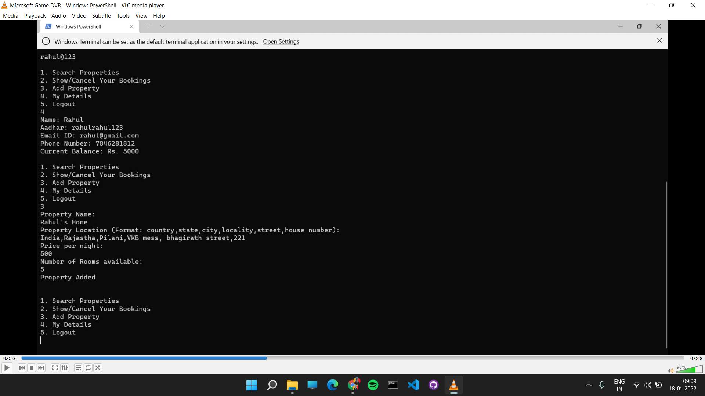
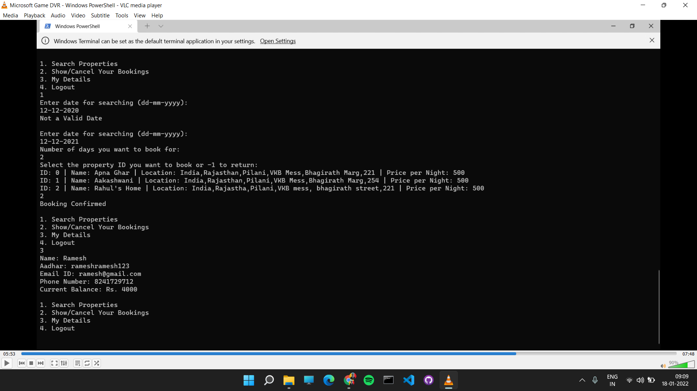
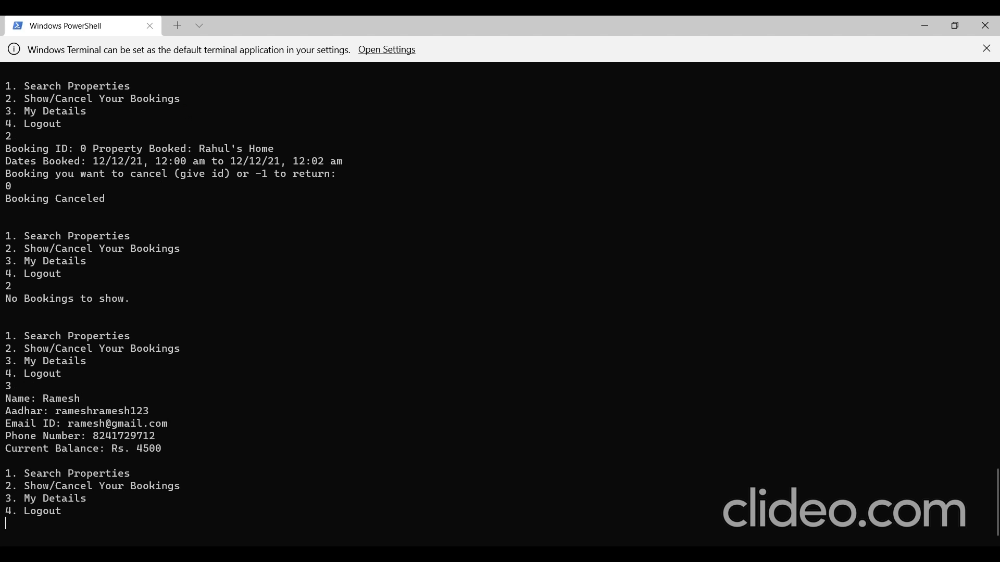

# AirBnB_project

> This is a capstone Java Project. This focuses on simulation of basic AirBnB interface.

## Contributors 

* [Arpit Sodani](https://github.com/arpitsodani15)
* [Lakshit Jain](https://github.com/jain-lakshit)

### Screenshots

The image above shows the login and sign up of the application. We can login or sign up as a customeror as a manager. In the image we are signing up as a manager named Rahul by entering the required details.

The image above shows how to add a property as a manager. We added a property as a manager named Rahul in the image.

The image above shows how to search for properties and then book a property as a customer. We are booking as a customer named Ramesh.

The image above shows how to cancel a booking. We are cancelling the booking we did previously.

### Running the application
1. Go to the Project_AirBnB_jar folder in command line window.
2. Now run > java -jar Project_AirBnB.jar

**The demo folder contains the demonstration video**